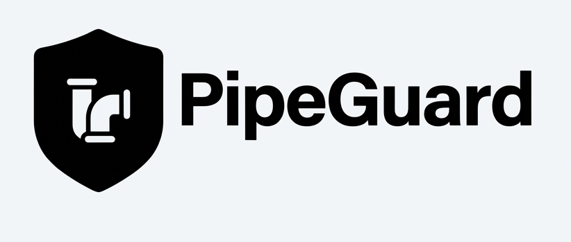

<p align="center">
  
</p>

<h1 align="center">PipeGuard</h1>
<p align="center"><strong>Pipeline Security & Quality Scanner</strong></p>

A fast, deterministic CLI tool that scans CI/CD pipelines, Dockerfiles, and Jenkinsfiles for security vulnerabilities and quality issues. Built in Go with zero external dependencies at runtime.

```
PIPEGUARD v0.1.0 — Pipeline Security & Quality Scanner by yhakkache
====================================================================

[SCAN] .gitlab-ci.yml (38 violations found)

  CRITICAL   R01   No secret scanning stage                    -3pts
  CRITICAL   R03   Hardcoded secret or credential in pipeline  -5pts
             Line 7 | DB_PASSWORD: "supersecret123"
  HIGH       R05   No Vault or external secret manager         -2pts
  ...

--------------------------------------------------------------------
RESULTS
--------------------------------------------------------------------
  Files scanned:    4
  Violations:       161 (16 critical, 35 high, 90 medium, 20 low)
  Auto-fixable:     150/161

  .gitlab-ci.yml       SECURITY    9/100    Level 0 — None
                       QUALITY    41/100    Level 2 — Developing
  Dockerfile           SECURITY   40/100    Level 2 — Developing
  Jenkinsfile          SECURITY   59/100    Level 2 — Developing
```

---

## Features

- **145 built-in rules** — hardcoded in Go, no database, no config files needed
- **4 file types** — GitLab CI, GitHub Actions, Jenkinsfile, Dockerfile
- **Dual scoring** — Security score (0-100) + Quality score (0-100)
- **Maturity levels** — Level 0 (None) to Level 5 (Optimized)
- **3 output formats** — Terminal (ANSI colors), JSON, SARIF v2.1.0
- **Fix suggestions** — deterministic auto-fix descriptions for ~85% of rules
- **CI/CD gate** — exit code 1 when critical or high violations found
- **Zero config** — point it at a directory and scan

## Installation

### Homebrew (macOS / Linux)

```bash
brew install tazi06/tap/pipeguard
```

### Curl Installer

```bash
curl -sfL https://raw.githubusercontent.com/tazi06/pipeguard/main/install.sh | sh
```

Detects OS/arch automatically, verifies checksums, installs to `/usr/local/bin`.

### Go Install

```bash
go install github.com/tazi06/pipeguard/cmd/pipeguard@latest
```

### From Source

```bash
git clone https://github.com/tazi06/pipeguard.git
cd pipeguard
make build
```

## Usage

### Basic Scan

```bash
# Scan current directory
pipeguard scan .

# Scan specific directory
pipeguard scan ./my-project/

# Scan single file
pipeguard scan Dockerfile
```

### Output Formats

```bash
# Terminal (default) — colored human-readable output
pipeguard scan .

# JSON — for automation and dashboards
pipeguard scan . --format json

# SARIF v2.1.0 — for GitHub/GitLab Security tabs
pipeguard scan . --format sarif

# Save to file
pipeguard scan . --format json --output report.json
pipeguard scan . --format sarif --output report.sarif
```

### Filtering

```bash
# Show only critical and high severity violations
pipeguard scan . --severity high

# Show only critical violations
pipeguard scan . --severity critical
```

### List Built-in Rules

```bash
# List all rules (table format)
pipeguard rules

# Output as JSON (machine-readable)
pipeguard rules --format json

# Filter by category
pipeguard rules --category SEC

# Filter by severity
pipeguard rules --severity critical

# Combine filters
pipeguard rules --category DOC --severity high
```

### Fix Suggestions

```bash
# Show fix suggestions for each violation
pipeguard scan . --fix
```

### Options

```bash
# Disable ANSI colors (for piping to files or CI logs)
pipeguard scan . --no-color

# Combine flags
pipeguard scan . --severity medium --format json --output report.json
```

## Rules

PipeGuard includes **145 rules** organized into 9 categories:

| Category | Code | Rules | Description |
|----------|------|-------|-------------|
| Secret Management | SEC | R01-R07 | Hardcoded secrets, vault integration, rotation |
| Static Analysis | SAS | R08-R14 | SAST scanning, linting, quality gates |
| Supply Chain | SCA | R15-R23 | Dependencies, images, SBOM, signing |
| Dynamic Testing | DST | R24-R27 | DAST, API testing, fuzzing |
| Deployment | DEP | R28-R36 | Approval, rollback, smoke tests, GitOps |
| Governance | GOV | R37-R45 | Dashboards, coverage, compliance, audit |
| Jenkinsfile | JEN | J01-J30 | Credentials, sandbox, timeout, cleanup |
| Dockerfile | DOC | D01-D40 | Base image, secrets, layers, hardening |
| Pipeline Quality | PQL | Q01-Q35 | Caching, DRY, triggers, concurrency |

### Severity Levels

| Severity | Points | Description |
|----------|--------|-------------|
| CRITICAL | 3-5 | Immediate security risk, must fix before deploy |
| HIGH | 2-3 | Significant vulnerability or major bad practice |
| MEDIUM | 2-3 | Moderate risk, should fix in current sprint |
| LOW | 1-2 | Minor issue, fix when convenient |
| INFO | 1 | Informational finding, best practice suggestion |

### Maturity Levels

| Level | Name | Score Range |
|-------|------|-------------|
| 0 | None | 0-19 |
| 1 | Initial | 20-39 |
| 2 | Developing | 40-59 |
| 3 | Defined | 60-74 |
| 4 | Managed | 75-89 |
| 5 | Optimized | 90-100 |

## CI/CD Integration

### GitLab CI

```yaml
pipeguard-scan:
  stage: security
  image: ghcr.io/tazi06/pipeguard:latest
  script:
    - pipeguard scan . --format sarif --output gl-pipeguard-report.sarif
  artifacts:
    reports:
      sast: gl-pipeguard-report.sarif
  allow_failure: false
```

### GitHub Actions

```yaml
- name: PipeGuard Scan
  run: |
    curl -sSL https://github.com/tazi06/pipeguard/releases/latest/download/pipeguard-linux-amd64 -o pipeguard
    chmod +x pipeguard
    ./pipeguard scan . --format sarif --output pipeguard.sarif

- name: Upload SARIF
  uses: github/codeql-action/upload-sarif@v3
  with:
    sarif_file: pipeguard.sarif
```

### Jenkins

```groovy
stage('PipeGuard') {
    steps {
        sh 'pipeguard scan . --format json --output pipeguard-report.json'
        archiveArtifacts artifacts: 'pipeguard-report.json'
    }
}
```

## Exit Codes

| Code | Meaning |
|------|---------|
| 0 | Scan completed, no critical/high violations |
| 1 | Scan completed, critical or high violations found |
| 2 | Scan error (invalid path, file read error, etc.) |

## Architecture

```
pipeguard/
  cmd/pipeguard/        CLI entry point (Cobra)
  pkg/
    detector/           File type detection (walk + identify)
    parser/             File content parser (lines + raw)
    rules/
      types.go          Core types (Rule, Violation, Severity...)
      engine.go         Rule evaluation engine
      pipeline_rules.go R01-R45 pipeline security rules
      jenkins_rules.go  J01-J30 Jenkinsfile rules
      dockerfile_rules.go D01-D40 Dockerfile rules
      quality_rules.go  Q01-Q35 pipeline quality rules
    scorer/             Dual scoring + maturity levels
    output/
      terminal.go       ANSI colored terminal output
      json.go           JSON formatter
      sarif.go          SARIF v2.1.0 formatter
      colors.go         ANSI color management
```

## Design Principles

- **Deterministic** — same input always produces same output, no AI/ML
- **Fast** — pure regex matching, no network calls, no external processes
- **Zero config** — works out of the box with sensible defaults
- **CI-native** — exit codes, SARIF output, severity filtering for gates
- **Professional** — ANSI colors (auto-disabled for non-terminals)

## Contributing

We welcome contributions from everyone! PipeGuard is a great project for first-time open source contributors.

### Quick Start

```bash
git clone https://github.com/tazi06/pipeguard.git
cd pipeguard
go build -o pipeguard ./cmd/pipeguard/
go test ./... -count=1
```

### Ways to Contribute

-  **Add new rules** — easiest way to contribute (copy an existing rule, change the regex)
- **Fix bugs** — check [open issues](https://github.com/tazi06/pipeguard/issues)
-  **Improve docs** — better explanations, examples, typo fixes
-  **New features** — HTML output, `--category` filter, rule listing command

 **Looking for a starting point?** Check issues labeled [`good first issue`](https://github.com/tazi06/pipeguard/issues?q=is%3Aissue+is%3Aopen+label%3A%22good+first+issue%22)

📖 Read the full **[Contributing Guide](CONTRIBUTING.md)** for coding standards, PR process, and rule-writing guide.

## License

[AGPL-3.0](LICENSE) — Free for open source use. Commercial licensing available for proprietary integration.

---

**Built by [yhakkache](https://www.linkedin.com/in/hakkache-yassine-857362160/)**
